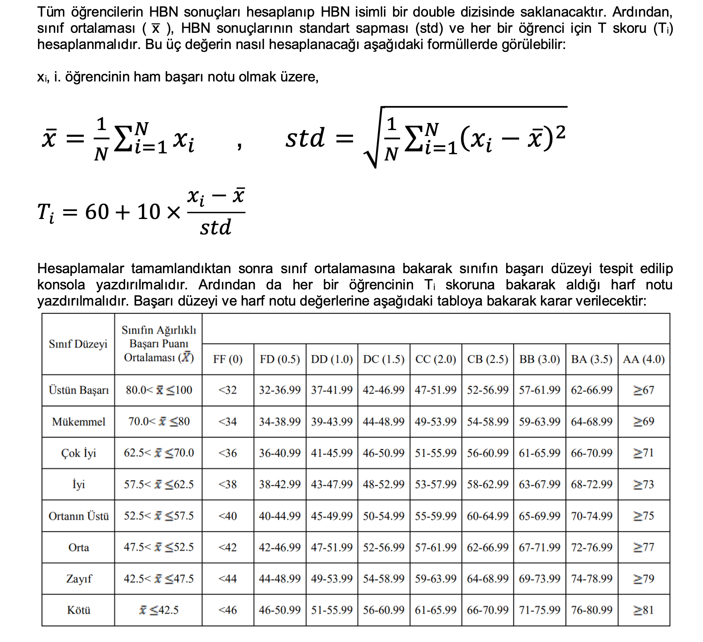

# Dönem Projesi
Proje kapsamında max 100 soruluk ve 100 öğrencilik bir sınav oluşturma ve değerlendirme sistemini C dilinde tasarlandı.
## Kısıtlamalar ve Formüller
Projede kullanılan fonksiyon imzaları asla değiştirilemez, kendi fonksiyonumuzu yazabiliriz
N: öğrenci sayısı
S: soru sayısı
B: herhangi bir sorunun boş bırakılma ihtimali (0 ila 1 aralığından bir reel sayı)
D: herhangi bir sorunun doğru cevaplanma ihtimali (0 ila 1 aralığından bir reel sayı) 
*4 yanlış 1 doğruyu götürecek, öğrencinin notu negatif bir sayı çıkarsa not 0 olarak kabul edilecektir.*

1- void cevap_anahtari_uret(char cevap_anahtari[ ], int S)
2- void cevap_anahtari_yazdir(char cevap_anahtari[ ], int S)
3- void sinavi_uygula(char ogrenci_cevaplari[ ][100], char cevap_anahtari[ ], int N, int S, double B, double D)
4- void ogrenci_cevabini_yazdir(char ogrenci_cevaplari[ ][100], int ogrenci_ID, int S) //ogrenci_ID 0 ~ N-1 arasında değişen bir indis olarak verilmeli

1- void ogrencileri_puanla(char ogrenci_cevaplari[ ][100], char cevap_anahtari[ ], double HBN[ ], int N, int S)
//fonksiyon, tüm öğrencilerin ham başarı notlarını hesaplayıp double HBN[ ] dizisine yazacak
2- double sinif_ortalamasi_hesapla(double HBN[ ], int N)
3- double standart_sapma_hesapla(double ortalama, double HBN[ ], int N)
4- void T_skoru_hesapla(double ortalama, double HBN[ ], int N, double std, double T_skoru[ ]) //fonksiyon, tüm öğrencilerin T skorlarını tek seferde hesaplayıp double T_skoru[ ] dizisine yazacak

  

